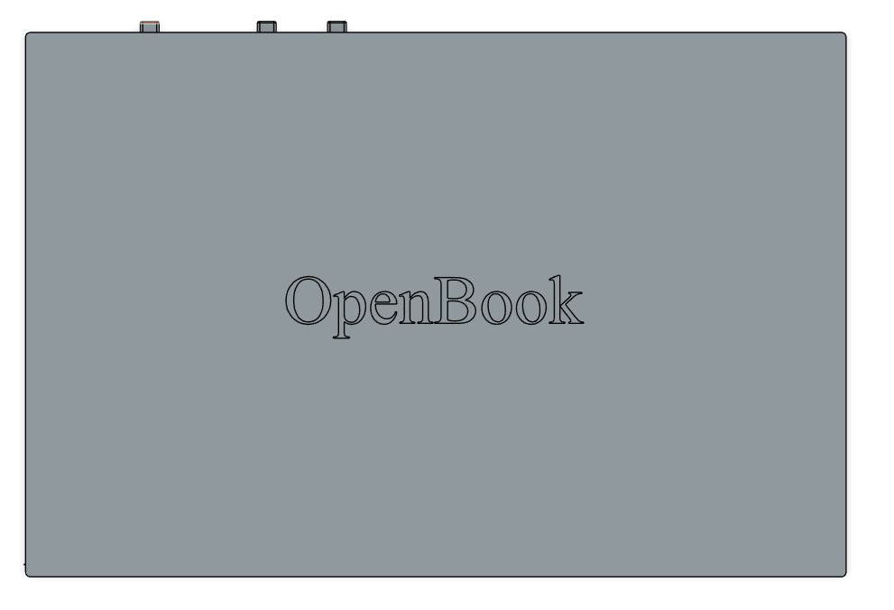
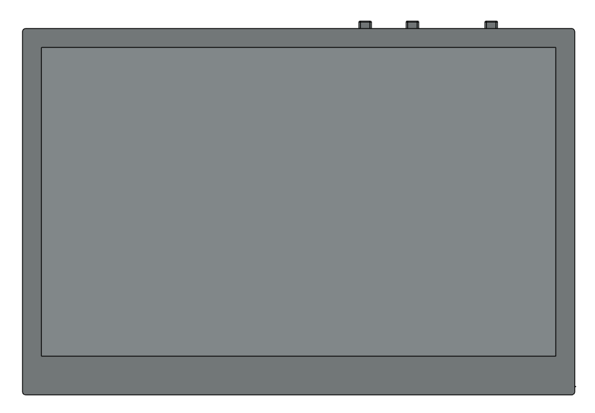
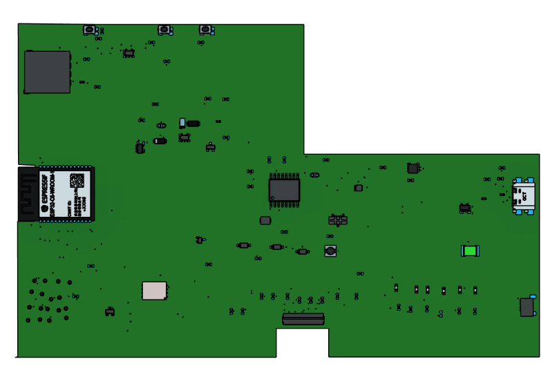

# TSC-OpenBook

An implementation of an open-source E-book reader made in Autodesk Fusion 360.

## Block Diagram

## Enclosure

## PCB

## Display

## Descrierea Funcționalității Hardware

Acest proiect utilizează modulul **ESP32-C6-WROOM-1-N8** ca unitate principală de microcontroler (MCU). Acest modul dispune de un nucleu RISC-V pe 32 de biți ce rulează până la 160MHz, conectivitate Wi-Fi 6 și Bluetooth 5 (BLE) integrate, 512KB SRAM și interfațează cu 8MB de memorie flash NOR externă (W25Q64JV) prin SPI pentru stocarea firmware-ului.

**Componente Cheie și Interfețe:**

* **Afișaj:** Un display E-Paper (EPD) alb-negru de 7.5 inci, cu rezoluție 800x480 pixeli, este utilizat ca ieșire vizuală principală. Acesta se conectează la ESP32-C6 printr-o interfață SPI cu 4 fire, suplimentată de pini dedicați pentru reset (RST), selecție dată/comandă (DC), selecție cip (CS) și indicarea stării de ocupat (BUSY).
* **Managementul Alimentării:**
    * Dispozitivul este alimentat de o baterie Litiu-Polimer de 3.7V, 2500mAh.
    * Încărcarea bateriei este gestionată de circuitul integrat **MCP73831**, acceptând alimentare prin portul USB-C. Un LED de stare indică starea încărcării.
    * Circuitul integrat **MAX17048** acționează ca un indicator al nivelului bateriei (fuel gauge), monitorizând starea de încărcare a bateriei și comunicând această informație către MCU prin magistrala I2C.
    * Un regulator Low-Dropout (LDO) **XC6220A331MR-G** convertește tensiunea bateriei sau tensiunea USB (VBUS) la tensiunea stabilă de 3.3V necesară componentelor sistemului.
    * Un supervizor de tensiune **BD5229G-TR** monitorizează magistrala de 3.3V și menține ESP32-C6 în reset dacă tensiunea scade sub un prag sigur, asigurând stabilitatea sistemului.
* **Senzori de Mediu:** Un senzor **BME688** este inclus pentru a măsura temperatura, umiditatea, presiunea barometrică și compușii organici volatili (VOC) pentru estimarea calității aerului. Acesta comunică cu ESP32-C6 prin magistrala I2C.
* **Ceas de Timp Real (RTC):** Un modul RTC **DS3231SN** oferă măsurare precisă a timpului, chiar și atunci când MCU-ul principal este într-o stare de consum redus. Include un supercondensator de backup (sau opțiune de conectare la baterie) și comunică prin magistrala I2C.
* **Stocare:** Pe lângă memoria flash SPI externă pentru firmware, este prevăzut un slot pentru card MicroSD pentru stocarea datelor utilizatorului (ex. cărți electronice). Acesta interfațează cu ESP32-C6 folosind protocolul SDIO (sau SPI).
* **Interfață Utilizator:** Trei butoane tactile sunt disponibile pentru interacțiunea cu utilizatorul:
    * Buton Reset: Declanșează direct resetarea sistemului prin pinul EN (prin intermediul supervizorului de tensiune).
    * Buton Boot (GPIO0): Folosit pentru a plasa manual ESP32-C6 în modul de programare/bootloader la resetare.
    * Buton Change (GPIO21): Un buton de uz general pentru funcții specifice aplicației (ex. întoarcerea paginii, navigare în meniu).
* **Conectivitate & Depanare:**
    * Un port **USB-C** oferă alimentare pentru încărcare și o interfață USB 2.0 Full-Speed pentru transfer de date și programare/depanare prin controlerul USB Serial/JTAG nativ al ESP32-C6. Protecție ESD (USBLC6-2SC6) este inclusă pe liniile USB.
    * Un conector **Qwiic/Stemma QT** oferă o modalitate ușoară de a conecta periferice I2C suplimentare.
    * Pad-urile de test expun semnale cheie precum UART (TXD, RXD), SPI (pentru Flash și Card SD) și I2C în scopuri de depanare și testare.

## Utilizarea Pinilor ESP32-C6

Următorul tabel detaliază pinii GPIO specifici utilizați pe modulul ESP32-C6-WROOM-1 și funcțiile acestora în cadrul acestui proiect:

| Pin ESP32-C6 | Funcție                           | Component(e) Conectat(e)               | Interfață/Motiv                                              |
| :----------- | :-------------------------------- | :------------------------------------- | :----------------------------------------------------------- |
| GPIO0        | Selecție Boot / Intrare Buton     | SW_BOOT (Buton Boot), R_BOOT         | Pin standard pentru selecția modului boot; Intrare utilizator |
| GPIO1        | Ceas I2C                          | U4 (MAX17048), U3 (DS3231), SENSOR2 (BME688), J5 (Qwiic) | Magistrală I2C comună (SCL) pentru multipli senzori/CI        |
| GPIO2        | Date I2C                          | U4 (MAX17048), U3 (DS3231), SENSOR2 (BME688), J5 (Qwiic) | Magistrală I2C comună (SDA) pentru multipli senzori/CI        |
| GPIO3        | Selecție Cip E-Paper              | J1 (Header EPD)                        | Selecție Cip SPI (CS) pentru Afișajul E-Paper              |
| GPIO4        | Dată/Comandă E-Paper              | J1 (Header EPD)                        | Control Dată/Comandă (DC) pentru Afișajul E-Paper          |
| GPIO5        | Reset E-Paper                     | J1 (Header EPD)                        | Semnal Reset (RST) pentru Afișajul E-Paper               |
| GPIO6        | Stare Ocupat E-Paper              | J1 (Header EPD)                        | Semnal intrare Ocupat (Busy) de la Afișajul E-Paper          |
| GPIO7        | Hold Flash Extern                 | U1 (W25Q64JV), TP17                    | Semnal SPI Hold (/HOLD) pentru memoria flash externă         |
| GPIO8        | Dată 0 Card SD                    | J2 (Slot Card SD), TP6                 | Linie Date SDIO 0 / SPI MISO                               |
| GPIO9        | Dată 1 Card SD                    | J2 (Slot Card SD), TP7                 | Linie Date SDIO 1                                          |
| GPIO10       | Comandă Card SD                   | J2 (Slot Card SD), TP5                 | Linie Comandă SDIO / SPI MOSI                              |
| GPIO11       | Ceas Card SD                      | J2 (Slot Card SD), TP4                 | Linie Ceas SDIO / SPI SCK                                  |
| GPIO12       | Protecție Scriere Flash Extern    | U1 (W25Q64JV), TP16                    | Semnal SPI Protecție Scriere (/WP) pentru flash extern      |
| GPIO13       | MISO Flash Extern                 | U1 (W25Q64JV), TP15                    | SPI Master In Slave Out (MISO) pentru flash extern         |
| GPIO14       | MOSI Flash Extern                 | U1 (W25Q64JV), TP14                    | SPI Master Out Slave In (MOSI) pentru flash extern         |
| GPIO15       | Selecție Cip Flash Extern         | U1 (W25Q64JV), TP13                    | Selecție Cip SPI (/CS) pentru memoria flash externă        |
| GPIO16       | UART TXD                          | TP12                                   | Date Transmise UART pentru depanare/programare             |
| GPIO17       | UART RXD                          | TP11                                   | Date Recepționate UART pentru depanare/programare          |
| GPIO18       | Ceas Flash Extern                 | U1 (W25Q64JV), TP3                     | Ceas SPI (SCK) pentru memoria flash externă                |
| GPIO19       | Dată 2 Card SD                    | J2 (Slot Card SD), TP8                 | Linie Date SDIO 2                                          |
| GPIO20       | Dată 3 Card SD / Detectare Card   | J2 (Slot Card SD), TP9                 | Linie Date SDIO 3 / Intrare Detectare Card                 |
| GPIO21       | Intrare Buton Change              | SW_CHANGE (Buton Change)               | Intrare de Uz General pentru interacțiune utilizator         |
| USB_D-       | Date Negative USB                 | J4 (Conector USB-C)                    | Semnal Nativ USB D-                                        |
| USB_D+       | Date Pozitive USB                 | J4 (Conector USB-C)                    | Semnal Nativ USB D+                                        |
| EN           | Activare Sistem / Reset           | U5 (BD5229G), SW_RESET (Buton Reset)   | Activare Cip, controlat de supervizor tensiune/buton       |
